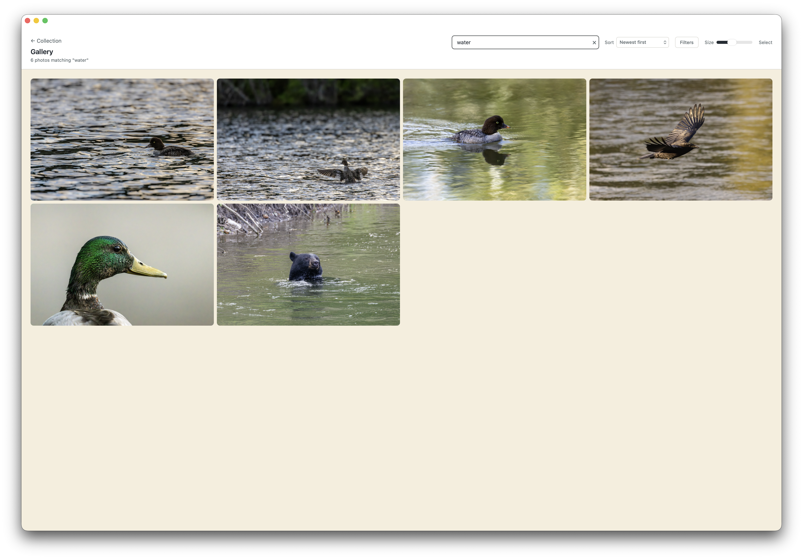
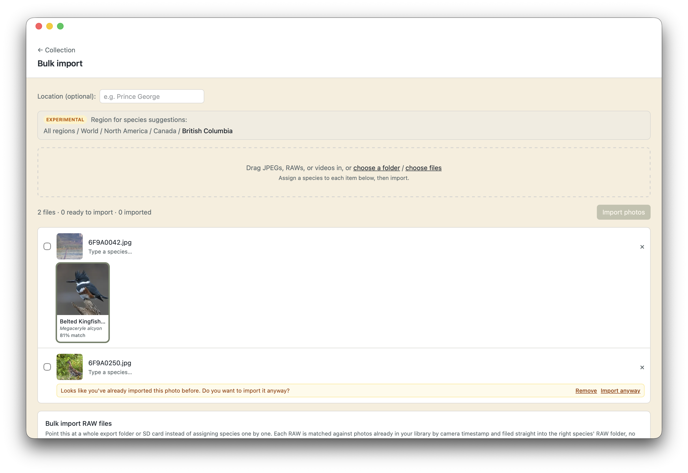
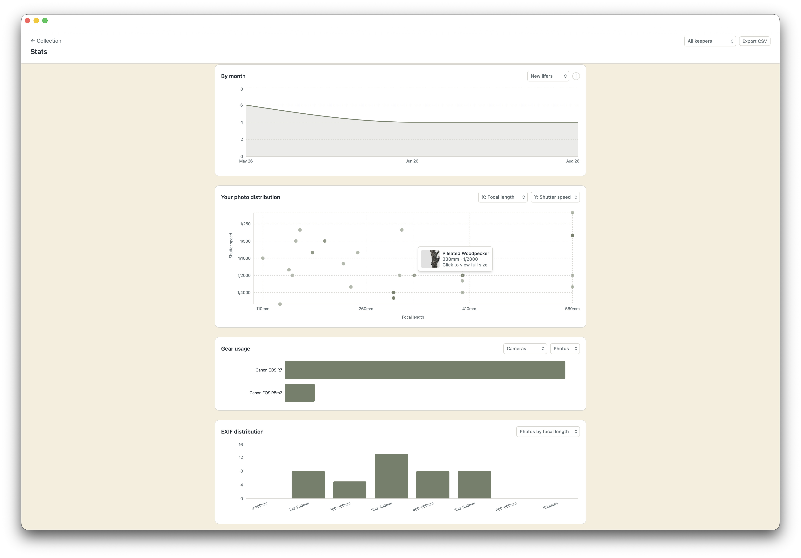

<p align="center">
  <picture>
    <source media="(prefers-color-scheme: dark)" srcset="./assets/branding/Dark%20Wordmark.png">
    
  </picture>
</p>

<p align="center">
  <a href="https://sparklysparkspark.github.io/lifer-app/"><strong>Documentation</strong></a> ·
  <a href="https://sparklysparkspark.github.io/lifer-app/install/desktop">Install</a> ·
  <a href="https://sparklysparkspark.github.io/lifer-app/getting-started">Getting started</a> ·
  <a href="https://sparklysparkspark.github.io/lifer-app/api/overview">API</a> ·
  <a href="../../releases/latest">Download</a>
</p>

Lifer is an open-source photo and video management and archival application built for wildlife
photographers.

It turns a collection of wildlife photos into a structured archive organized around **species,
taxonomy, locations, dates, trips, and albums**, while also maintaining your photographic life
list and regional checklists. A species only counts as "collected" once you've actually attached
your own photo of it. This isn't a sightings log.

Your photographs and videos remain on the drives you choose. Lifer provides the wildlife-specific
organization and information built around them.



## Your wildlife collection, organized

Wildlife photography collections get hard to keep track of as they grow. Photos accumulate across
years, trips, locations, and storage drives. You might have photographed a species several times
without knowing where all of those photos are, or keep your life list somewhere entirely separate
from your actual photo archive.

Lifer brings those together. Import a batch from a shoot, a whole folder from a trip, or a photo
at a time from a species' own page. Lifer can use local AI to suggest a species for anything
still unidentified, trained against your own collection rather than a cloud service, and you
confirm or correct it in a couple keystrokes.



Once imported, a photo belongs to a species, a trip, a location, a date, and your life list all at
once. You don't have to build those relationships by hand.

## Organize your files your way

Lifer doesn't impose a particular folder structure on your originals. Uploads land in a real,
navigable folder tree grouped by taxon and species (with a separate `RAW` folder alongside your
edited copy, linked automatically by filename and capture time). Species folders can be named
using common names, scientific names, eBird codes, ABA codes, or full taxonomy, whichever you
prefer:

```
Lifer Photos/Birds/<species name>/Adjusted/<your edited JPEG>
Lifer Photos/Birds/<species name>/RAW/<matching RAW file>
```

Your physical file organization is yours to set, and can be changed later if your preferences
change.

## From photographs to a life list

Your archive and your life list are connected. Browse checklists by region (country,
province/state, or a nearby marine zone for fish), see exactly which species you still need, and
watch photographed species join your life list automatically. Each species carries a rarity tier
(how hard it is to actually go find and photograph, not conservation status), a reference photo,
and habitat info, so you know roughly what you're looking for.


Checklists are meant to be personal: hide or archive species you're not pursuing so the list
reflects your own goals, not every species that could theoretically occur somewhere in the region.

## Wildlife information, downloaded once

Species packs carry the reference photos, taxonomy, distribution, and rarity info for a region.
Download the ones you care about and they work fully offline afterward. Full checklist and
reference-photo coverage is live for **birds, mammals, fish, reptiles, turtles, amphibians and
marine invertebrates**.


For anything outside Lifer's curated data, species can be imported from iNaturalist instead:
insects, plants, fungi, and the rest of the iNaturalist taxonomy.

## Everything you've shot, and what it adds up to

Browse the whole Gallery across every species, searchable by name, place, date, focal length ("600mm"), or a
natural-language description of the shot ("fox playing"). Group favorites into Albums, point Lifer
at a trip's folder without copying anything in, and check Stats for a real breakdown of your own
archive: most-photographed species, gear-and-species patterns, year-over-year comparisons.



## Your files stay yours

There is no Lifer cloud service and no required account. Your photos and videos remain on the
drives you choose, including a collection spread across several external drives (common for a
photographer before they consolidate). Lifer tracks which drive each photo lives on and still shows
a thumbnail when that drive is unplugged, so you always know which one to go grab rather than
needing every drive connected just to browse.

Species and taxonomy get written into your actual files, not hidden away in a Lifer-only database:
a flat keyword list (common name, scientific name, eBird/ABA codes) plus a Lightroom/digiKam-style
hierarchical tag (`Species/Aves/Alcedinidae/Belted Kingfisher`), using the same standard IPTC/XMP
fields those tools already read. That means a collection already tagged in Lightroom or digiKam
can be recognized on import instead of asking you to identify everything again, and if you ever
stop using Lifer, pointing a fresh install at the same files rebuilds the collection from that
metadata.

## Run it your way

Lifer runs as a desktop app (macOS, Windows, Linux) or as a self-hosted Docker server on your own
hardware, useful for a collection on a NAS or for reaching the same archive from several devices.
There's no Lifer-hosted service involved either way.

|                  | **Desktop app**                      | **Server**                              |
| ---------------- | ------------------------------------ | --------------------------------------- |
| Where it runs    | Your own computer                    | A NAS or always-on machine, via Docker  |
| Who can reach it | Just you, on that machine            | Anyone with the URL and login           |
| Login            | None                                 | One account and password                |
| Share links, API | No                                   | Yes                                     |

The desktop app can also be a client for a server you already run, and can move a local library up
to a server whenever you're ready.

## Quick install

**Desktop app:** download the installer for your OS from the [latest release](../../releases/latest):
`Lifer-macos-arm64.zip` (Apple Silicon Macs), the `.exe` for Windows, or the `.AppImage`/`.deb` for
Linux. The builds aren't signed with a paid certificate, so macOS needs **Open Anyway** in
System Settings > Privacy & Security, and Windows needs **More info > Run anyway**. See the
[desktop install guide](https://sparklysparkspark.github.io/lifer-app/install/desktop).

**Docker server:**

1. Download [`docker-compose.yml`](./docker-compose.yml) and [`.env.example`](./.env.example) into a
   folder, and rename `.env.example` to `.env`.
2. In `.env`, set `LIFER_STORAGE_DIR` to your photo folder.
3. Run `docker compose up -d`, then open `http://<server-ip>:4000` and create your account.

The [Docker install guide](https://sparklysparkspark.github.io/lifer-app/install/docker) covers
volumes, extra library folders, HTTPS, backups, updating, and every
[environment variable](https://sparklysparkspark.github.io/lifer-app/install/environment-variables).

## Documentation

Everything else lives on the **[documentation site](https://sparklysparkspark.github.io/lifer-app/)**:
the user guide (importing, library folders, checklists, gallery and search, trips, albums and
sharing, eBird, stats), a reference for every Settings page, troubleshooting, and the
[API guide](https://sparklysparkspark.github.io/lifer-app/api/overview) for your own integrations.
The source is in [`docs/`](./docs).

## Status

Lifer is currently in beta. It's actively developed, and some features and interfaces may change
before the first stable release. Bug reports and feedback are welcome through GitHub Issues and
Discussions.

## Contributing

Working on Lifer itself, not just running it? See [CONTRIBUTING.md](./CONTRIBUTING.md) and the
[development setup guide](https://sparklysparkspark.github.io/lifer-app/contributing/development).

## License

[AGPL-3.0](./LICENSE).
